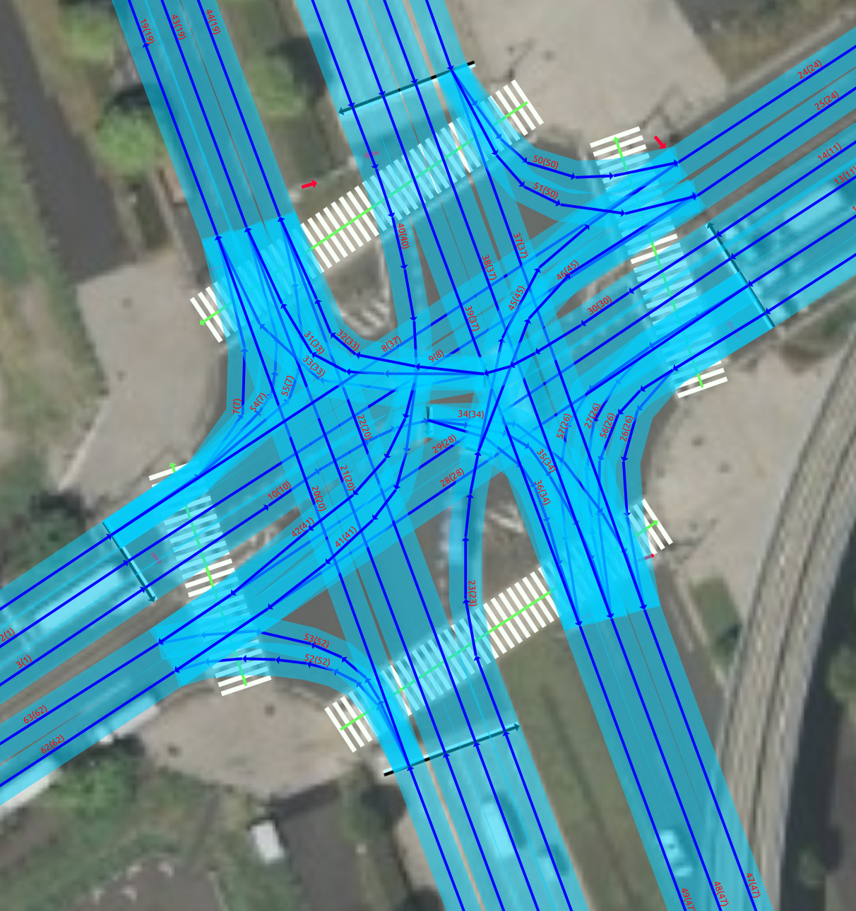
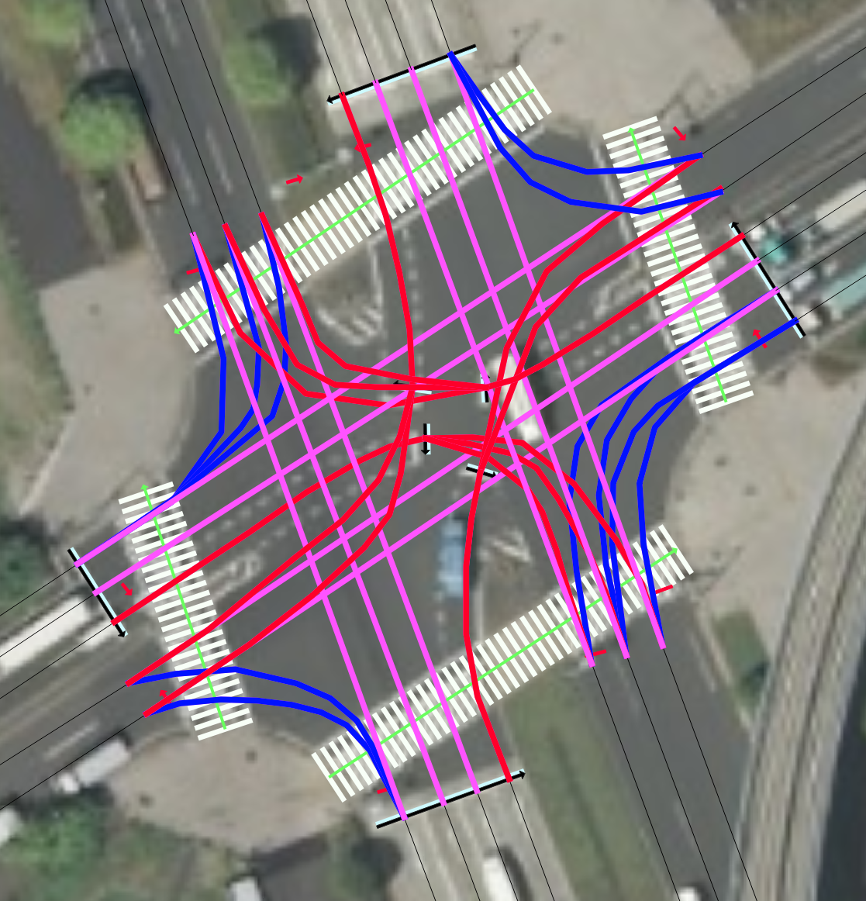
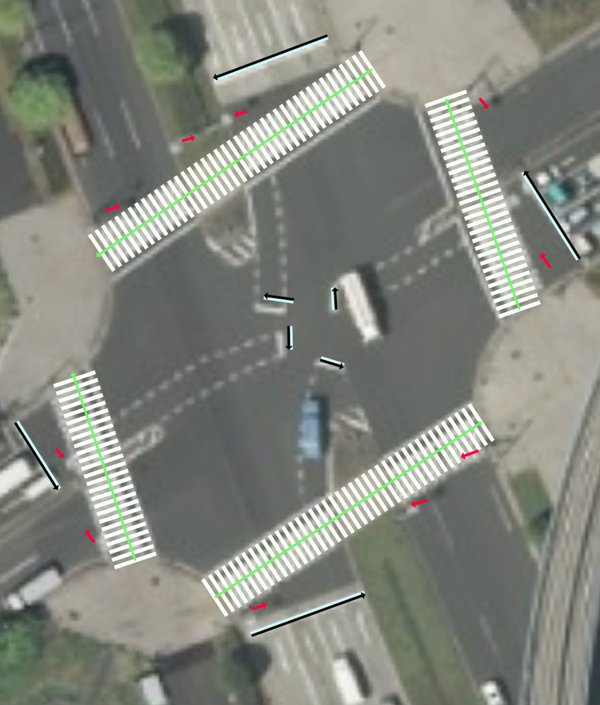
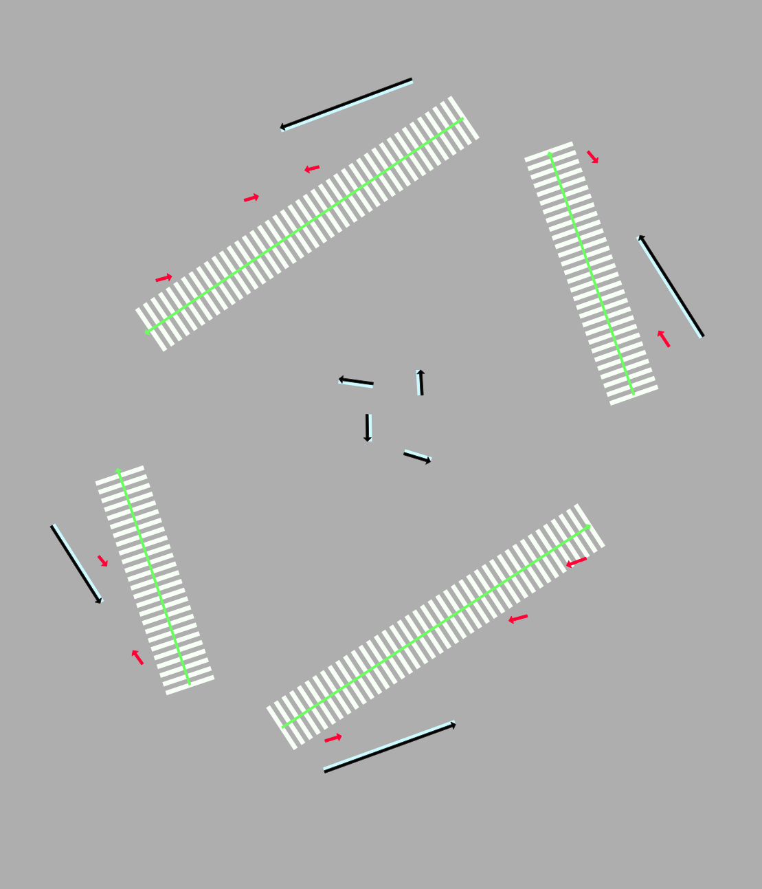
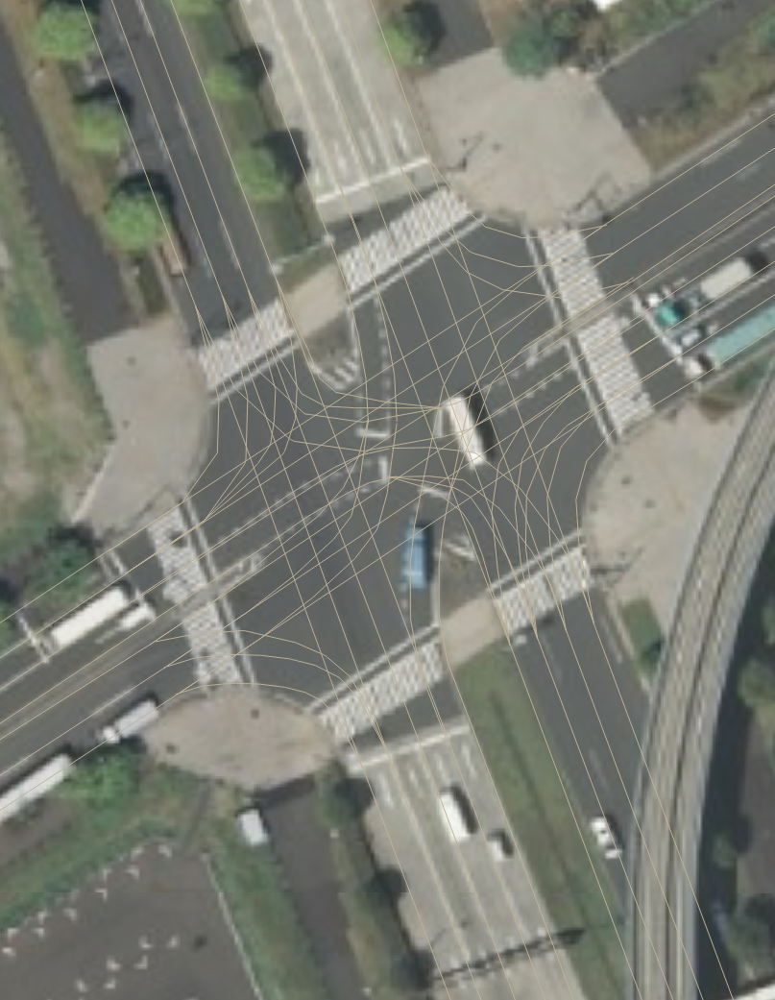
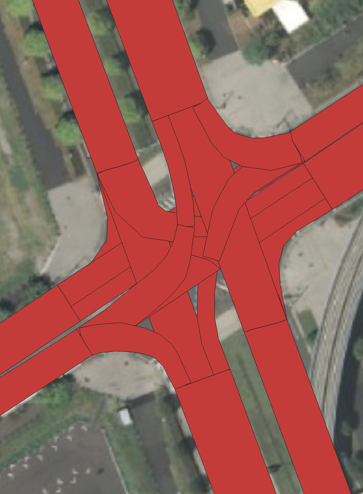
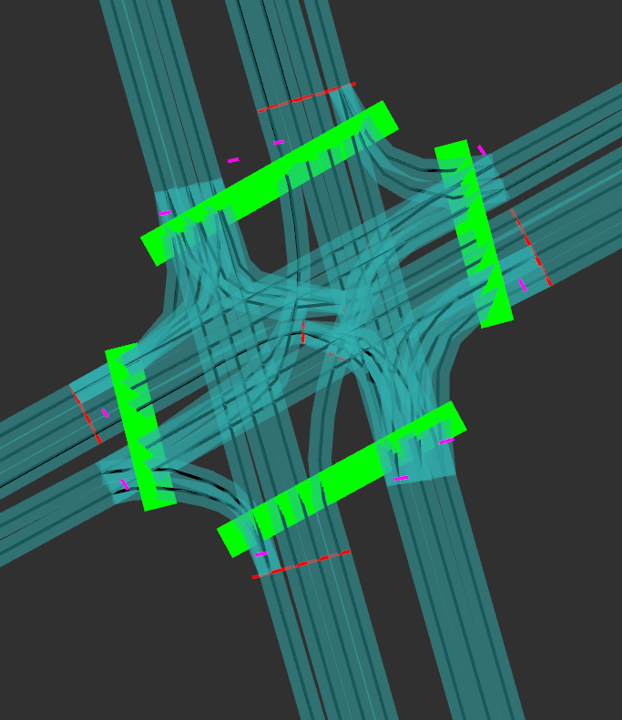

# Vector Map Creation

## An image of created vector map

- lane center: blue arrow and lightblue area
- crosswalk: green arrow and white ladder
- stop line: black arrow and white area
- traffic light: red arrow

## Visualizing styles can be customized like this

- pink: straight
- blue: turn left
- red: turn right

## Without lanes for simplicity

## Without aerial images

## Autogeneration of features

Some relationships and features can be automatically generated using a preprocess script.  
For example, lane boundaries and lane sections can be generated as below.

## Visualization in RViz

You can visualize your map in RViz as well.

